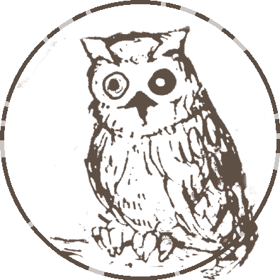

# Neverland Exlibris Generator
## Purpose
Convert a string to morse and generate a transparent png with the Neverland's owl.  
Message start at 9 O'clock.  

## Requisites
Pillow  
feh for preview  

## Installation
```
git clone https://github.com/s-loiseau/neverland_morse.git
cd neverland_morse
pip install -r requirements.txt
```  

## Usage
```
python exlibris.py <STRING> <WIDTH>
```  

## Samples
### FREEDOM
```
python exlibris.py FREEDOM 8
```  


### RUN
```
python exlibris.py RUN 13
```  

